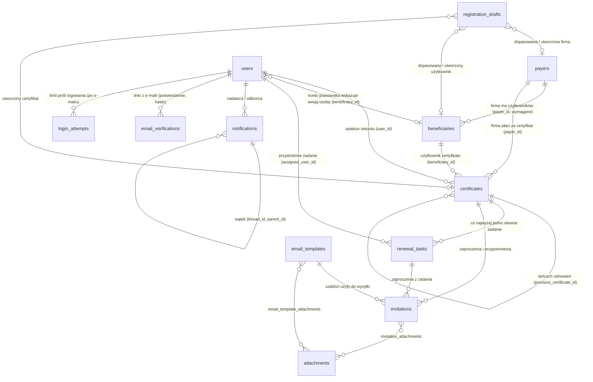

# Baza danych — co przechowujemy i jak tabele są ze sobą powiązane

Opis stanu po Etapie 10 (2026-10-02). Źródłem prawdy jest `database/schema.sql` (świeża instalacja) oraz migracje
z `classes/Migrations/` (aktualizacja istniejących baz) — oba dają dokładnie ten sam kształt tabel (patrz §8).

## 1. Bazy w projekcie

| Baza | Do czego służy | Kto ją tworzy |
|---|---|---|
| `assistent_subscriptions` | główna baza aplikacji CertiSub Assistant: ewidencja certyfikatów, osób, firm, zadania, zaproszenia, wnioski e-mail, powiadomienia, historia | `php scripts/migrate.php` (instalacja i aktualizacje) |
| `assistent_subscriptions_test` | jednorazowa baza testów integracyjnych — **kasowana i budowana od zera przy każdym uruchomieniu** `RUN_INTEGRATION_TESTS=1 composer test`; nigdy nie dotyka danych użytkownika | testy (`tests/Support/MysqlTestDatabase.php`) |
| `menedzer_subskrypcji` (+ `_test`) | osobna aplikacja „Menedżer Subskrypcji” (prywatne subskrypcje: Netflix, Spotify…) z własnymi kontami — **nie ma żadnej wspólnej tabeli** z bazą firmową i aplikacje nie linkują do siebie | repozytorium `menedzer_subskrypcji` |

Baza firmowa to jedna dziedzina i jedna aplikacja. Dla własnych celów (np. podgląd interfejsu na kopii) można wskazać inną
nazwę bazy zmienną środowiskową `CERTISUB_DB_NAME` (patrz `config/database.php`).

## 2. Diagram powiązań



Tabela `events` (historia zdarzeń) celowo nie ma kluczy obcych — patrz §5.

## 3. Reguły spójności (co baza gwarantuje sama)

Najważniejsza zasada ewidencji, wymuszona **trzema warstwami** (baza → usługi → interfejs):

> **Bez firmy nie istnieje użytkownik certyfikatu, a bez użytkownika nie istnieje certyfikat kwalifikowany.**

| Reguła | Jak jest pilnowana w bazie |
|---|---|
| użytkownik certyfikatu (`beneficiaries`) zawsze ma firmę | kolumna `payer_id` jest `NOT NULL`, klucz obcy `ON DELETE RESTRICT` — firmy z użytkownikami nie da się usunąć |
| certyfikat kwalifikowany (`QUALIFIED_SIGNATURE`, `QUALIFIED_SEAL`) zawsze ma użytkownika | ograniczenie `CHECK chk_certificates_qualified_user`; klucz `certificates.beneficiary_id` ma `ON DELETE RESTRICT ON UPDATE RESTRICT` (MySQL nie pozwala łączyć `CHECK` z akcją `CASCADE` na tej samej kolumnie) |
| certyfikat zawsze ma firmę i opiekuna | `payer_id` i `user_id` są `NOT NULL`, klucze `RESTRICT` |
| rabat jest procentem od 0 do 100 | `CHECK chk_certificates_discount` (kolumna `discount_percent DECIMAL(5,2)`) |
| numer seryjny jest unikalny u wystawcy | `UNIQUE (issuer, serial_number)` |
| NIP firmy jest unikalny w całej bazie (także w archiwum) | `UNIQUE (tax_id)` |
| co najwyżej jedno otwarte zadanie odnowienia na certyfikat | kolumna wyliczana `open_marker` + `UNIQUE (certificate_id, open_marker)` |
| adres e-mail konta jest unikalny | `UNIQUE (email)` |
| ta sama wiadomość e-mail nie powstaje jako wniosek dwa razy | `UNIQUE (message_id)` i `UNIQUE (content_hash)` w `registration_drafts` |

Usługi (`CertificateService`, `BeneficiaryService`…) sprawdzają te same reguły wcześniej i zwracają czytelny błąd pola
(np. „Certyfikat kwalifikowany nie istnieje bez użytkownika”), a baza jest ostatnią linią obrony (wyjątek SQL zamiast
cichego zapisu niespójnych danych). Dane sprzed wprowadzenia reguł naprawia migracja `company_integrity`: osoba bez firmy
dostaje firmę swojego certyfikatu albo „Firma do uzupełnienia”, a certyfikat kwalifikowany bez osoby — osobę
„Użytkownik do uzupełnienia” z firmą certyfikatu.

**Archiwizacja zamiast usuwania.** Firmy, użytkownicy certyfikatów i certyfikaty mają `archived_at`; bieżące zapytania
filtrują `archived_at IS NULL`, a rekordy archiwalne są tylko do odczytu. Firmy nie da się zarchiwizować, dopóki ma
bieżących użytkowników lub certyfikaty; osoby — dopóki ma bieżące certyfikaty; przywrócenie certyfikatu wymaga bieżącej
firmy i osoby.

## 4. Opis tabel

### 4.1. Konta i logowanie

| Tabela | Co przechowuje | Powiązania |
|---|---|---|
| `users` | **konta personelu**: imię, nazwisko, e-mail (unikalny), `role` (`ADMIN`, `DIRECTOR`, `MANAGER`, `ACCOUNTANT`, `IT`, `OPERATOR`, `EMPLOYEE`), skrót hasła (`password_hash`), `email_verified_at`, `last_login_at`, `deactivated_at` (wyłączone konto nie loguje się, ale zostaje jako autor historii), `beneficiary_id` (konto pracownika wskazuje osobę, której certyfikaty są jego „własnymi”), `company_filter` (JSON z filtrem firm operatora) | `beneficiary_id → beneficiaries` (SET NULL) |
| `email_verifications` | jednorazowe tokeny z e-maili: potwierdzenie adresu (`EMAIL_VERIFY`) i ustawienie/reset hasła (`PASSWORD_SET`); w bazie tylko skrót SHA-256 tokenu, termin ważności i znacznik użycia | `user_id → users` (CASCADE) |
| `login_attempts` | historia prób logowania (e-mail, IP, wynik) — podstawa limitu chroniącego przed zgadywaniem haseł; bez klucza obcego, bo zapisuje też próby na nieistniejące adresy | brak |
| `login_otps` | historia kodów jednorazowych sprzed Etapu 9 (logowanie jest hasłem); zostaje jako ślad | `user_id → users` (CASCADE) |

### 4.2. Ewidencja: firmy, użytkownicy certyfikatów, certyfikaty

| Tabela | Co przechowuje | Powiązania |
|---|---|---|
| `payers` — **firmy (płatnicy)** | nazwa, osoba kontaktowa, **NIP** (unikalny, z sumą kontrolną), e-mail, telefon, adres, kod, miasto, `created_by_user_id` (kto wprowadził — zakres danych operatora), `archived_at` | `created_by_user_id → users` (SET NULL) |
| `beneficiaries` — **użytkownicy certyfikatów** | imię, nazwisko, e-mail, telefon, notatki, **`payer_id` (wymagane — firma)**, `created_by_user_id`, `archived_at` | `payer_id → payers` (RESTRICT), `created_by_user_id → users` (SET NULL) |
| `certificates` — **certyfikaty i usługi** | nazwa, `certificate_type` (certyfikat kwalifikowany, pieczęć kwalifikowana, SSL, podpis kodu, domena, SaaS, wsparcie chmurowe, inne), numer seryjny, wystawca, `valid_from`, `expiry_date`, `renewal_lead_days`, `status`, **`discount_percent` (rabat 0–100, w interfejsie pokazywany jako -3%, -5%…)**, `billing_cycle`, `payment_status`, `last_payment_date`, `auto_renew`, notatki, `archived_at` | `user_id → users` (opiekun, RESTRICT), `beneficiary_id → beneficiaries` (RESTRICT; wymagane dla typów kwalifikowanych), `payer_id → payers` (RESTRICT), `previous_certificate_id → certificates` (łańcuch odnowień, SET NULL) |

`payer_id` zostaje także przy certyfikacie: domyślnie przepisuje się z firmy użytkownika, ale konkretny certyfikat może opłacać
inna firma.

### 4.3. Proces odnowień

| Tabela | Co przechowuje | Powiązania |
|---|---|---|
| `renewal_tasks` | lista ToDo: zadanie odnowienia z priorytetem (`expired/critical/warning/ok`), terminem, statusem (`todo/in_progress/done/abandoned`), przydzieloną osobą, notatką wyniku i datą zamknięcia | `certificate_id → certificates` (RESTRICT), `assigned_user_id → users` (SET NULL) |
| `invitations` | zaproszenia do odnowienia i przypomnienia: odbiorca (użytkownik albo firma), **treść zapisana w chwili wysyłki**, status (`queued/sent/failed/responded/closed`), licznik i termin kolejnego przypomnienia, ostatni błąd | `certificate_id → certificates`, `renewal_task_id → renewal_tasks`, `template_id → email_templates`, `sent_by_user_id → users` |
| `email_templates` | szablony wiadomości (kod + język, temat, treść HTML i tekstowa z polami `{imie}`, `{numer_seryjny}`…) | — |
| `attachments` | biblioteka plików (nazwa oryginalna, nazwa na dysku w `storage/attachments`, typ MIME, rozmiar, SHA-256, kto wgrał) | `uploaded_by_user_id → users` |
| `email_template_attachments`, `invitation_attachments` | tabele łączące N–N: które załączniki mają szablon i które poszły z konkretnym zaproszeniem | do `email_templates`/`invitations` (CASCADE) i `attachments` (RESTRICT) |

### 4.4. Wnioski przesłane e-mailem (Etap 10)

| Tabela | Co przechowuje | Powiązania |
|---|---|---|
| `registration_drafts` | **kolejka robocza operatora**: wiadomość z wnioskiem zamieniona na formularz. Kolumny: `status` (`pending/approved/rejected`), `source` (`upload/imap/webhook/cli`), `message_id` i `content_hash` (unikalne — ochrona przed duplikatem), nadawca, temat, treść tekstowa, `raw_file` (nazwa pliku oryginału w `storage/intake`), JSON-y: `extracted` (co odczytano z wiadomości), `form` (formularz edytowany przez operatora), `company_lookup` (odpowiedź Białej Listy: `found/not_found/error`), `warnings` (wątpliwości do wyjaśnienia); `assigned_user_id`, `reviewed_by_user_id`, `rejection_reason` | `matched_payer_id`/`matched_beneficiary_id → payers`/`beneficiaries` (już istniejące rekordy), `result_payer_id`/`result_beneficiary_id`/`result_certificate_id` (utworzone przy zatwierdzeniu), użytkownicy — wszystko `SET NULL` |

### 4.5. Komunikacja, historia i ustawienia

| Tabela | Co przechowuje | Powiązania |
|---|---|---|
| `notifications` | **powiadomienia wewnętrzne** między kontami: jeden wiersz = jedna wiadomość dla jednego odbiorcy (do kilku osób — kilka wierszy o wspólnym `batch_key`). `type` (`message/request/error/system`), temat, treść, `read_at`, `resolved_at` (prośba załatwiona), `archived_at`, wątek (`thread_id` = pierwsza wiadomość, `parent_id` = odpowiedź na…), `related_type` + `related_id` (certyfikat, użytkownik, firma albo wniosek, którego dotyczy wiadomość). Komunikaty systemowe nie mają nadawcy | `sender_user_id → users` (SET NULL), `recipient_user_id → users` (CASCADE) |
| `events` | **historia zdarzeń** (oś czasu certyfikatu, osoby, firmy i dziennik administratora): typ i id encji, typ zdarzenia, konto, kolumny kontekstu `certificate_id/beneficiary_id/payer_id`, `payload` (JSON ze szczegółami zmian), czas | **brak kluczy obcych celowo** — historia ma przetrwać archiwizację i usunięcie rekordów |
| `settings` | zmiany progów procesu odnowień wprowadzone przez administratora (wartości domyślne są w kodzie) | `updated_by_user_id → users` |
| `schema_migrations` | nazwy zastosowanych migracji (patrz §7) | — |

## 5. Reguły usuwania i aktualizacji (ON DELETE)

| Rodzaj | Efekt | Gdzie |
|---|---|---|
| `RESTRICT` | nie da się usunąć rekordu, na który ktoś wskazuje | firma → osoby i certyfikaty; osoba → certyfikaty; konto → certyfikaty (opiekun); certyfikat → zadania i zaproszenia; załącznik użyty w szablonie lub zaproszeniu |
| `CASCADE` | wiersze zależne znikają razem z rodzicem | konto → tokeny, kody i **powiadomienia odebrane**; szablon/zaproszenie → wiersze łączące załączniki |
| `SET NULL` | powiązanie jest zerowane, rekord zostaje | autorzy i przydziały po usunięciu konta; `users.beneficiary_id` po usunięciu osoby; wskazania wniosku na utworzone rekordy |
| brak klucza | świadomie — rekord ma przetrwać wszystko | `events`, `login_attempts` |

W praktyce aplikacja niczego nie usuwa twardo (archiwizuje), więc reguły `RESTRICT` działają jak zabezpieczenie przed
błędem w kodzie, a nie jak codzienna ścieżka.

## 6. Przepływy danych

**Cykl życia certyfikatu:** firma + użytkownik + certyfikat → skaner (`cron/renewals.php`) zakłada zadanie w `renewal_tasks`
→ zaproszenie w `invitations` (treść z `email_templates`, pliki z `attachments`) → przypomnienia → odnowienie
(nowy `certificates` z `previous_certificate_id`, stary do archiwum) albo porzucenie. Każdy krok zapisuje wiersz w `events`.

**Wniosek z e-maila:** wiadomość (plik / IMAP / webhook / potok) → `registration_drafts` (odczyt danych + odpowiedź Białej Listy +
dopasowanie `matched_*`) → operator sprawdza formularz → „Zatwierdź” w **jednej transakcji** tworzy firmę (jeśli jej nie było),
użytkownika w tej firmie i certyfikat, a wniosek dostaje `result_*` i status `approved`. Błąd na dowolnym kroku wycofuje wszystko.

**Zakres danych (kto co widzi)** nie jest zapisany w tabelach, tylko liczony z roli konta (`classes/Rbac.php`,
`classes/Service/Visibility.php`): administrator, szef, menedżer i księgowość widzą całą organizację; informatyk — certyfikaty
techniczne; operator — własne i przydzielone certyfikaty oraz powiązane osoby i firmy; pracownik — tylko swoje certyfikaty
(jako opiekun albo przez `users.beneficiary_id`) i firmy, do których należą. Filtr firm (`users.company_filter`) tylko zawęża listy.

## 7. Migracje (`schema_migrations`)

| Nazwa | Etap | Zmiana |
|---|---|---|
| `login_otp` | 0 | unikalny e-mail konta, tabela kodów jednorazowych |
| `certificates_model` | 1 | `subscriptions → certificates`; osoby, zadania, szablony, załączniki, zaproszenia, historia |
| `accounts_and_ownership` | 2 | wyłączanie kont, autor rekordów osób i firm |
| `renewal_process` | 3 | ustawienia procesu odnowień |
| `otp_rate_limit` | 6 | adres IP w kodach logowania (limit w bazie) |
| `split_personal_app` | 8 | wyprowadzenie panelu prywatnego do osobnej aplikacji |
| `password_auth` | 9 | hasła, potwierdzanie adresu, limit prób logowania |
| `certificate_discount` | 10 | `annual_cost` i `currency` zastąpione przez `discount_percent` (+ `CHECK` 0–100) |
| `company_integrity` | 10 | firma wymagana u osoby, osoba wymagana przy certyfikacie kwalifikowanym (+ naprawa starych danych) |
| `company_roles` | 10 | role stanowisk, `users.beneficiary_id` |
| `company_filter` | 10 | `users.company_filter` (filtr firm) |
| `notifications` | 10 | powiadomienia wewnętrzne |
| `registration_drafts` | 10 | wnioski z e-maila |

Migracje są idempotentne (każdy krok sprawdza stan przez `SchemaInspector`). **Przed migracją istniejącej bazy zrób zrzut:**
`mysqldump assistent_subscriptions > kopia.sql` — migracja `certificate_discount` usuwa kolumnę z kwotą.

## 8. Jak sprawdzić, że `schema.sql` i migracje dają to samo

Baza testowa jest budowana z `schema.sql` i dopiero potem przechodzą po niej migracje, więc różnica między nią a bazą
zaktualizowaną migracjami od starego stanu oznaczałaby błąd w którymś z dwóch źródeł:

```bash
# po uruchomieniu testów integracyjnych baza assistent_subscriptions_test jest świeża
for db in assistent_subscriptions assistent_subscriptions_test; do
  mysql -uroot -N -e "select table_name, column_name, column_type, is_nullable, coalesce(column_default,'NULL'), extra from information_schema.columns where table_schema='$db' order by table_name, column_name" > cols_$db.txt
done
diff cols_assistent_subscriptions.txt cols_assistent_subscriptions_test.txt && echo "Kolumny identyczne"
```

Stan z 2026-10-02: **190 kolumn, 87 pozycji indeksów, 32 klucze obce i 2 ograniczenia CHECK** — identyczne w obu bazach.

## 9. Dane poza bazą

| Miejsce | Zawartość |
|---|---|
| `storage/attachments/` | pliki załączników (nazwa losowa, w bazie tylko metadane i skrót); katalog zablokowany przez HTTP |
| `storage/intake/` | oryginały wiadomości z wnioskami (`.eml`), do ponownego odczytu po poprawie ekstraktora; zablokowany przez HTTP, poza gitem |
| `storage/cache/` | pamięć podręczna agregatów pulpitu (klucz zawiera rolę, konto i filtr firm) i tokeny OAuth2 |
| `config/*.local.php` | hasła i tokeny (poczta, skrzynka IMAP, webhook) — poza repozytorium |
| `logs/` | `renewals.log`, `mail-intake.log`, `mail-errors.log` |
